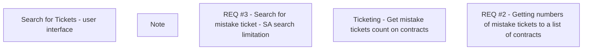

# CBL-8891 (CLM-2860) Sales Agents contract search limitation

- **Diagram Type**: Custom
- **Package**: HomerSelect/BSL/Modules/Ticketing (TCK)/Requirements/CBL-8891 (CLM-2860) Sales Agents contract search limitation
- **Diagram ID**: 156091
- **Elements**: 5
- **Connectors**: 0

