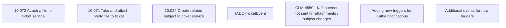

# CLM-4550 - Kafka event not sent for attachments / subject changes

```mermaid
graph TD
    n_10_072_Attach_a_file_to_ticket_service["10.072 Attach a file to ticket service"]
    n_10_071_Take_and_attach_photo_file_to_ticket["10.071 Take and attach photo file to ticket"]
    n_10_034_Create_related_subject_to_ticket_service["10.034 Create related subject to ticket service"]
    ADD_TicketEvent["{ADD}TicketEvent"]
    CLM_4550_Kafka_event_not_sent_for_attachments_subject_change["CLM-4550 - Kafka event not sent for attachments / subject changes"]
    Adding_new_triggers_for_Kafka_notifications["Adding new triggers for Kafka notifications"]
    Additional_events_for_new_triggers["Additional events for new triggers"]
```
