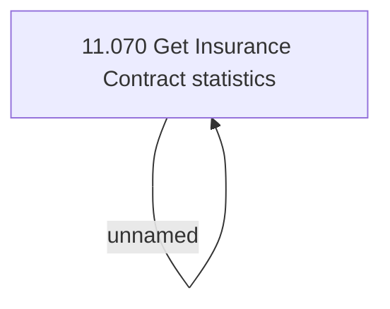

# Access Rights

- **Diagram Type**: Custom
- **Package**: HomerSelect/BSL/Modules/Value Added Services (VAS)/Analytical Model/Insurance Contract statistics/Access Rights
- **Diagram ID**: 142937
- **Elements**: 2
- **Connectors**: 1

