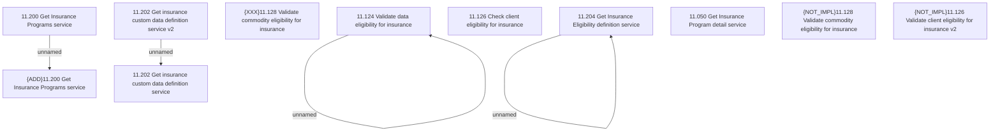

# Access Rights

```mermaid
graph TD
    ADD_11_200_Get_Insurance_Programs_service["{ADD}11.200 Get Insurance Programs service"]
    n_11_200_Get_Insurance_Programs_service["11.200 Get Insurance Programs service"]
    n_11_124_Validate_data_eligibility_for_insurance["11.124 Validate data eligibility for insurance"]
    n_11_124_Validate_data_eligibility_for_insurance["11.124 Validate data eligibility for insurance"]
    XXX_11_128_Validate_commodity_eligibility_for_insurance["{XXX}11.128 Validate commodity eligibility for insurance"]
    n_11_204_Get_Insurance_Eligibility_definition_service["11.204 Get Insurance Eligibility definition service"]
    n_11_126_Check_client_eligibility_for_insurance["11.126 Check client eligibility for insurance"]
    n_11_204_Get_Insurance_Eligibility_definition_service["11.204 Get Insurance Eligibility definition service"]
    n_11_202_Get_insurance_custom_data_definition_service["11.202 Get insurance custom data definition service"]
    n_11_202_Get_insurance_custom_data_definition_service_v2["11.202 Get insurance custom data definition service v2"]
    n_11_050_Get_Insurance_Program_detail_service["11.050 Get Insurance Program detail service"]
    NOT_IMPL_11_128_Validate_commodity_eligibility_for_insurance["{NOT_IMPL}11.128 Validate commodity eligibility for insurance"]
    NOT_IMPL_11_126_Validate_client_eligibility_for_insurance_v2["{NOT_IMPL}11.126 Validate client eligibility for insurance v2"]
    n_11_124_Validate_data_eligibility_for_insurance -->|unnamed| n_11_124_Validate_data_eligibility_for_insurance
    n_11_204_Get_Insurance_Eligibility_definition_service -->|unnamed| n_11_204_Get_Insurance_Eligibility_definition_service
    n_11_200_Get_Insurance_Programs_service -->|unnamed| ADD_11_200_Get_Insurance_Programs_service
    n_11_202_Get_insurance_custom_data_definition_service_v2 -->|unnamed| n_11_202_Get_insurance_custom_data_definition_service
```
