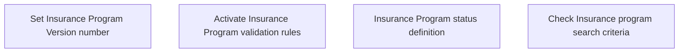

# Business Rules

- **Diagram Type**: Custom
- **Package**: HomerSelect/BSL/Modules/Value Added Services (VAS)/Analytical Model/Insurance Program/Insurance Program management/Business Rules
- **Diagram ID**: 135206
- **Elements**: 4
- **Connectors**: 0

