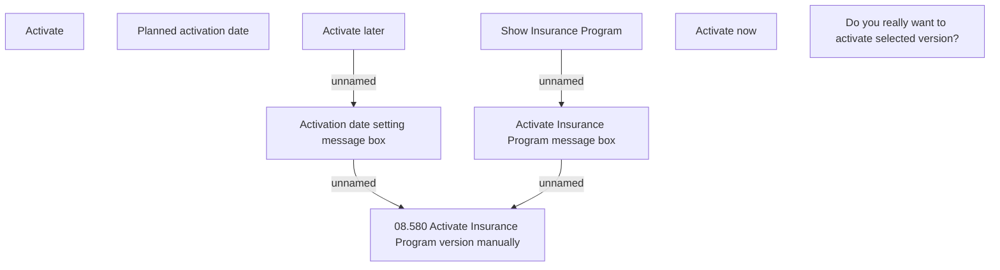

# Activate Insurance Program

```mermaid
graph TD
    Activate["Activate"]
    Planned_activation_date["Planned activation date"]
    n_08_580_Activate_Insurance_Program_version_manually["08.580 Activate Insurance Program version manually"]
    Activation_date_setting_message_box["Activation date setting message box"]
    Show_Insurance_Program["Show Insurance Program"]
    Activate_later["Activate later"]
    Activate_now["Activate now"]
    Do_you_really_want_to_activate_selected_version["Do you really want to activate selected version?"]
    Activate_Insurance_Program_message_box["Activate Insurance Program message box"]
    Show_Insurance_Program -->|unnamed| Activate_Insurance_Program_message_box
    Activate_later -->|unnamed| Activation_date_setting_message_box
    Activation_date_setting_message_box -->|unnamed| n_08_580_Activate_Insurance_Program_version_manually
    Activate_Insurance_Program_message_box -->|unnamed| n_08_580_Activate_Insurance_Program_version_manually
```
