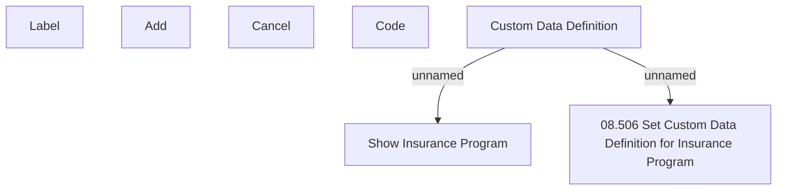

# Add/Update Custom data definition

```mermaid
graph TD
    Show_Insurance_Program["Show Insurance Program"]
    n_08_506_Set_Custom_Data_Definition_for_Insurance_Program["08.506 Set Custom Data Definition for Insurance Program"]
    Label["Label"]
    Add["Add"]
    Cancel["Cancel"]
    Code["Code"]
    Custom_Data_Definition["Custom Data Definition"]
    Custom_Data_Definition -->|unnamed| Show_Insurance_Program
    Custom_Data_Definition -->|unnamed| n_08_506_Set_Custom_Data_Definition_for_Insurance_Program
```
