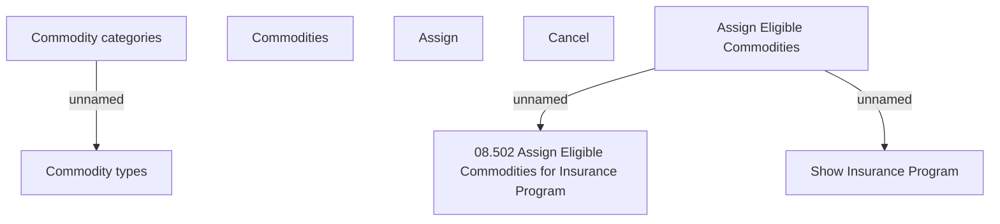

# Assign Eligible commodities

```mermaid
graph TD
    Show_Insurance_Program["Show Insurance Program"]
    n_08_502_Assign_Eligible_Commodities_for_Insurance_Program["08.502 Assign Eligible Commodities for Insurance Program"]
    Commodity_types["Commodity types"]
    Commodity_categories["Commodity categories"]
    Commodities["Commodities"]
    Assign["Assign"]
    Cancel["Cancel"]
    Assign_Eligible_Commodities["Assign Eligible Commodities"]
    Commodity_categories -->|unnamed| Commodity_types
    Assign_Eligible_Commodities -->|unnamed| n_08_502_Assign_Eligible_Commodities_for_Insurance_Program
    Assign_Eligible_Commodities -->|unnamed| Show_Insurance_Program
```
