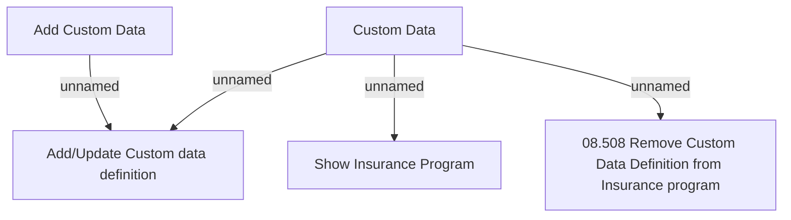

# Custom data tab

```mermaid
graph TD
    n_08_508_Remove_Custom_Data_Definition_from_Insurance_progra["08.508 Remove Custom Data Definition from Insurance program"]
    Show_Insurance_Program["Show Insurance Program"]
    Add_Update_Custom_data_definition["Add/Update Custom data definition"]
    Add_Custom_Data["Add Custom Data"]
    Custom_Data["Custom Data"]
    Custom_Data["Custom Data"]
    Add_Custom_Data -->|unnamed| Add_Update_Custom_data_definition
    Custom_Data -->|unnamed| Add_Update_Custom_data_definition
    Custom_Data -->|unnamed| Show_Insurance_Program
    Custom_Data -->|unnamed| n_08_508_Remove_Custom_Data_Definition_from_Insurance_progra
```
