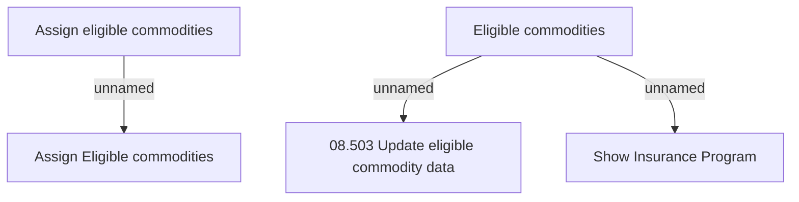

# Eligible commodities tab

```mermaid
graph TD
    Assign_Eligible_commodities["Assign Eligible commodities"]
    n_08_503_Update_eligible_commodity_data["08.503 Update eligible commodity data"]
    Show_Insurance_Program["Show Insurance Program"]
    Assign_eligible_commodities["Assign eligible commodities"]
    Eligible_commodities["Eligible commodities"]
    Eligible_commodities["Eligible commodities"]
    Assign_eligible_commodities -->|unnamed| Assign_Eligible_commodities
    Eligible_commodities -->|unnamed| n_08_503_Update_eligible_commodity_data
    Eligible_commodities -->|unnamed| Show_Insurance_Program
```
