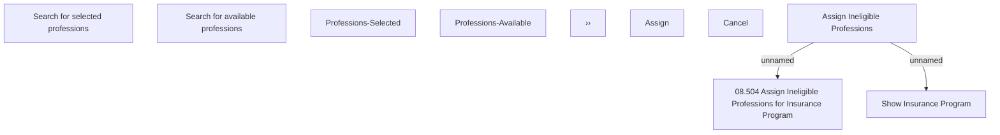

# Ineligible professions assigning

- **Diagram Type**: Custom
- **Package**: HomerSelect/BSL/Modules/Value Added Services (VAS)/Analytical Model/Insurance Program/Insurance Program management/User Interface Model/Ineligible professions tab
- **Diagram ID**: 134675
- **Elements**: 13
- **Connectors**: 2

