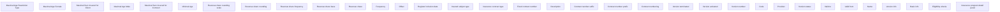

# Insurance Program detail panel

```mermaid
graph TD
    Maximal_Age_Restriction_Type["Maximal Age Restriction Type"]
    Maximal_Age_Female["Maximal Age Female"]
    Maximal_Sum_Insured_for_Client["Maximal Sum Insured for Client"]
    Maximal_Age_Male["Maximal Age Male"]
    Maximal_Sum_Insured_for_Contract["Maximal Sum Insured for Contract"]
    Minimal_Age["Minimal Age"]
    Revenue_share_rounding_scale["Revenue share rounding scale"]
    Revenue_share_rounding["Revenue share rounding"]
    Revenue_share_frequency["Revenue share frequency"]
    Revenue_share_base["Revenue share base"]
    Revenue_share["Revenue share"]
    Frequency["Frequency"]
    Offset["Offset"]
    Register_inclusion_date["Register inclusion date"]
    Insured_subject_type["Insured subject type"]
    Insurance_contract_type["Insurance contract type"]
    Fixed_contract_number["Fixed contract number"]
    Description["Description"]
    Contract_number_suffix["Contract number suffix"]
    Contract_number_prefix["Contract number prefix"]
    Contract_numbering["Contract numbering"]
    Version_terminated["Version terminated"]
    Version_activated["Version activated"]
    Version_number["Version number"]
    Code["Code"]
    Provider["Provider"]
    Version_status["Version status"]
    Valid_to["Valid to"]
    Valid_from["Valid from"]
    Name["Name"]
    Revenue_share["Revenue share"]
    Register_inclusion_date["Register inclusion date"]
    Contract_numbering["Contract numbering"]
    Version_info["Version info"]
    Basic_info["Basic info"]
    Eligibility_criteria["Eligibility criteria"]
    Description["Description"]
    Insurance_program_detail_panel["Insurance program detail panel"]
```
