# Search for Insurance Program

- **Diagram Type**: Custom
- **Package**: HomerSelect/BSL/Modules/Value Added Services (VAS)/Analytical Model/Insurance Program/Insurance Program management/User Interface Model
- **Diagram ID**: 135210
- **Elements**: 17
- **Connectors**: 3

```mermaid
graph TD
    Show_Insurance_Program["Show Insurance Program"]
    Create_Insurance_Program["Create Insurance Program"]
    n_08_570_Search_for_Insurance_Program["08.570 Search for Insurance Program"]
    Subject_type["Subject type"]
    Provider["Provider"]
    Valid_to["Valid to"]
    Valid_from["Valid from"]
    Version_Status["Version Status"]
    Add_Insurance_program["Add Insurance program"]
    Name["Name"]
    Code["Code"]
    Search_results["Search results"]
    Search_for_Insurance_program_criteria["Search for Insurance program criteria"]
    Reset["Reset"]
    Search["Search"]
    Search_buttons["Search buttons"]
    Search_for_Insurance_programs["Search for Insurance programs"]
    Search_for_Insurance_programs -->|unnamed| n_08_570_Search_for_Insurance_Program
    Add_Insurance_program -->|unnamed| Create_Insurance_Program
    Search_results -->|unnamed| Show_Insurance_Program
```

