# Set main Insurance Program properties

- **Diagram Type**: Custom
- **Package**: HomerSelect/BSL/Modules/Value Added Services (VAS)/Analytical Model/Insurance Program/Insurance Program management/User Interface Model
- **Diagram ID**: 135207
- **Elements**: 43
- **Connectors**: 8

```mermaid
graph TD
    Show_Insurance_Program["Show Insurance Program"]
    Next["Next"]
    Summary["Summary"]
    Previous["Previous"]
    Insurance_Program_detail_panel["Insurance Program detail panel"]
    Update["Update"]
    Summary_panel["Summary panel"]
    Maximal_Sum_Insured_for_Contract["Maximal Sum Insured for Contract"]
    Maximal_Sum_Insured_for_Client["Maximal Sum Insured for Client"]
    Minimal_Age["Minimal Age"]
    Maximal_Age_Male["Maximal Age Male"]
    Maximal_Age_Female["Maximal Age Female"]
    Maximal_Age_Restriction_Type["Maximal Age Restriction Type"]
    Eligibility_criteria["Eligibility criteria"]
    Revenue_share["Revenue share"]
    Revenue_share_base["Revenue share base"]
    Revenue_share_frequency["Revenue share frequency"]
    Revenue_share_rounding["Revenue share rounding"]
    Rounding_scale["Rounding scale"]
    Revenue_share["Revenue share"]
    Register_inclusion_date["Register inclusion date"]
    Register_inclusion_date_offset["Register inclusion date offset"]
    Register_inclusion_date_frequency["Register inclusion date frequency"]
    Register_inclusion_date["Register inclusion date"]
    Contract_numbering["Contract numbering"]
    Fixed_contract_number["Fixed contract number"]
    Contract_number_prefix["Contract number prefix"]
    Contract_number_suffix["Contract number suffix"]
    Contract_numbering["Contract numbering"]
    Salesroom["Salesroom"]
    Description["Description"]
    Valid_to["Valid to"]
    Valid_from["Valid from"]
    Name["Name"]
    Insurance_contract_type["Insurance contract type"]
    Basic_info["Basic info"]
    n_08_550_Set_main_Insurance_Program_properties["08.550 Set main Insurance Program properties"]
    Insurance_subject_type["Insurance subject type"]
    Version_number["Version number"]
    Insurance_program_code["Insurance program code"]
    Code_and_Type_panel["Code and Type panel"]
    Back["‹- Back"]
    Insurance_program_update["Insurance program update"]
    Insurance_program_update -->|unnamed| n_08_550_Set_main_Insurance_Program_properties
    Code_and_Type_panel -->|unnamed| Basic_info
    Basic_info -->|unnamed| Contract_numbering
    Contract_numbering -->|unnamed| Register_inclusion_date
    Register_inclusion_date -->|unnamed| Revenue_share
    Revenue_share -->|unnamed| Eligibility_criteria
    Eligibility_criteria -->|unnamed| Summary_panel
    Insurance_program_update -->|unnamed| Show_Insurance_Program
```

