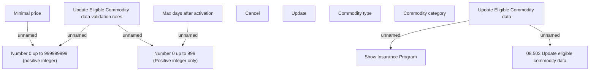

# Update Eligible commodity

```mermaid
graph TD
    n_08_503_Update_eligible_commodity_data["08.503 Update eligible commodity data"]
    Show_Insurance_Program["Show Insurance Program"]
    Number_0_up_to_999999999_positive_integer["Number 0 up to 999999999 (positive integer)"]
    Minimal_price["Minimal price"]
    Update_Eligible_Commodity_data_validation_rules["Update Eligible Commodity data validation rules"]
    Number_0_up_to_999_Positive_integer_only["Number 0 up to 999 (Positive integer only)"]
    Max_days_after_activation["Max days after activation"]
    Cancel["Cancel"]
    Update["Update"]
    Commodity_type["Commodity type"]
    Commodity_category["Commodity category"]
    Update_Eligible_Commodity_data["Update Eligible Commodity data"]
    Update_Eligible_Commodity_data_validation_rules -->|unnamed| Number_0_up_to_999_Positive_integer_only
    Max_days_after_activation -->|unnamed| Number_0_up_to_999_Positive_integer_only
    Minimal_price -->|unnamed| Number_0_up_to_999999999_positive_integer
    Update_Eligible_Commodity_data_validation_rules -->|unnamed| Number_0_up_to_999999999_positive_integer
    Update_Eligible_Commodity_data -->|unnamed| Show_Insurance_Program
    Update_Eligible_Commodity_data -->|unnamed| n_08_503_Update_eligible_commodity_data
```
