# Business rules

- **Diagram Type**: Custom
- **Package**: HomerSelect/BSL/Modules/Value Added Services (VAS)/Analytical Model/VAS Deal/Business rules
- **Diagram ID**: 159081
- **Elements**: 11
- **Connectors**: 0

```mermaid
graph TD
    Calculate_Net_Premium_based_on_Revenue_Share["Calculate Net Premium based on Revenue Share"]
    Determine_register_inclusion_date["Determine register inclusion date"]
    Get_Service_definition_from_Services["Get Service definition from Services"]
    Get_Service_definition_from_New_Service_Catalogue["Get Service definition from New Service Catalogue"]
    UpdateDealPeriod_validation["UpdateDealPeriod validation"]
    CreateDealPeriod_validation["CreateDealPeriod validation"]
    Get_Commodity_data_by_commodityId["Get Commodity data by commodityId"]
    Check_INSR_Insurance_Program_eligibility["Check INSR Insurance Program eligibility"]
    Generate_Insurance_Deal_Code["Generate Insurance Deal Code"]
    Get_INSR_Insurance_Program_data["Get INSR Insurance Program data"]
    CreateDeal_validation["CreateDeal validation"]
```

