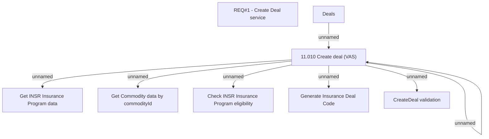

# CSI-1454 Create Deal method implementation

```mermaid
graph TD
    REQ_1_Create_Deal_service["REQ#1 - Create Deal service"]
    Deals["Deals"]
    Get_INSR_Insurance_Program_data["Get INSR Insurance Program data"]
    Get_Commodity_data_by_commodityId["Get Commodity data by commodityId"]
    Check_INSR_Insurance_Program_eligibility["Check INSR Insurance Program eligibility"]
    Generate_Insurance_Deal_Code["Generate Insurance Deal Code"]
    CreateDeal_validation["CreateDeal validation"]
    n_11_010_Create_deal_VAS["11.010 Create deal (VAS)"]
    n_11_010_Create_deal_VAS["11.010 Create deal (VAS)"]
    Deals -->|unnamed| n_11_010_Create_deal_VAS
    n_11_010_Create_deal_VAS -->|unnamed| Check_INSR_Insurance_Program_eligibility
    n_11_010_Create_deal_VAS -->|unnamed| Get_INSR_Insurance_Program_data
    n_11_010_Create_deal_VAS -->|unnamed| CreateDeal_validation
    n_11_010_Create_deal_VAS -->|unnamed| n_11_010_Create_deal_VAS
    n_11_010_Create_deal_VAS -->|unnamed| Get_Commodity_data_by_commodityId
    n_11_010_Create_deal_VAS -->|unnamed| Generate_Insurance_Deal_Code
```
