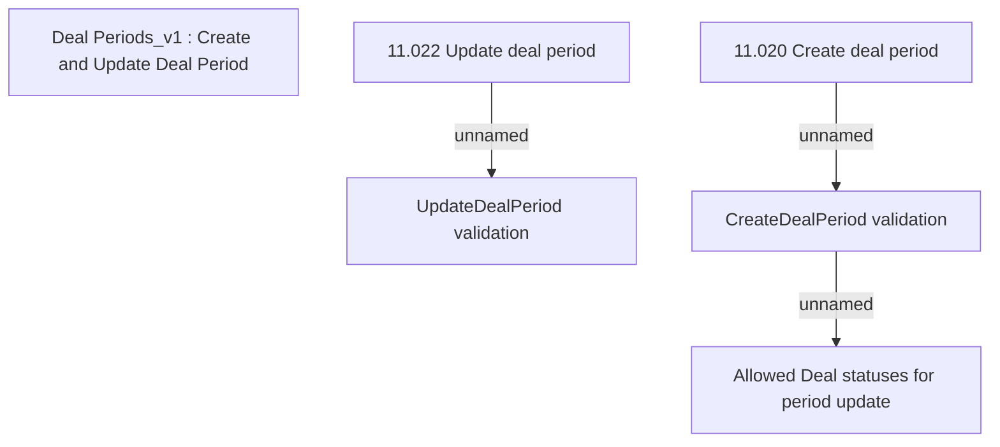

# CSI-1660 Period methods implementation

```mermaid
graph TD
    Deal_Periods_v1_Create_and_Update_Deal_Period["Deal Periods_v1 : Create and Update Deal Period"]
    UpdateDealPeriod_validation["UpdateDealPeriod validation"]
    CreateDealPeriod_validation["CreateDealPeriod validation"]
    Allowed_Deal_statuses_for_period_update["Allowed Deal statuses for period update"]
    n_11_022_Update_deal_period["11.022 Update deal period"]
    n_11_020_Create_deal_period["11.020 Create deal period"]
    n_11_022_Update_deal_period -->|unnamed| UpdateDealPeriod_validation
    n_11_020_Create_deal_period -->|unnamed| CreateDealPeriod_validation
    CreateDealPeriod_validation -->|unnamed| Allowed_Deal_statuses_for_period_update
```
