# CSI-1806 Create Deal method modification

- **Diagram Type**: Custom
- **Package**: HomerSelect/BSL/Modules/Value Added Services (VAS)/Requirement model/CBL-11727 (CSI-376) CSI Modularization - Insurance Contract/CSI-1806 Create Deal method modification
- **Diagram ID**: 146180
- **Elements**: 9
- **Connectors**: 7

```mermaid
graph TD
    Get_INSR_Insurance_Program_data["Get INSR Insurance Program data"]
    Get_Commodity_data_by_commodityId["Get Commodity data by commodityId"]
    Check_INSR_Insurance_Program_eligibility["Check INSR Insurance Program eligibility"]
    Generate_Insurance_Deal_Code["Generate Insurance Deal Code"]
    CreateDeal_validation["CreateDeal validation"]
    Get_Service_definition_from_Services["Get Service definition from Services"]
    Get_Service_definition_from_New_Service_Catalogue["Get Service definition from New Service Catalogue"]
    n_11_010_Create_deal_VAS["11.010 Create deal (VAS)"]
    Schema_definitions_Deal_structures["Schema definitions : Deal structures"]
    n_11_010_Create_deal_VAS -->|unnamed| Check_INSR_Insurance_Program_eligibility
    n_11_010_Create_deal_VAS -->|unnamed| Get_INSR_Insurance_Program_data
    n_11_010_Create_deal_VAS -->|unnamed| CreateDeal_validation
    n_11_010_Create_deal_VAS -->|unnamed| Get_Service_definition_from_Services
    n_11_010_Create_deal_VAS -->|unnamed| Get_Commodity_data_by_commodityId
    n_11_010_Create_deal_VAS -->|unnamed| Get_Service_definition_from_New_Service_Catalogue
    n_11_010_Create_deal_VAS -->|unnamed| Generate_Insurance_Deal_Code
```

