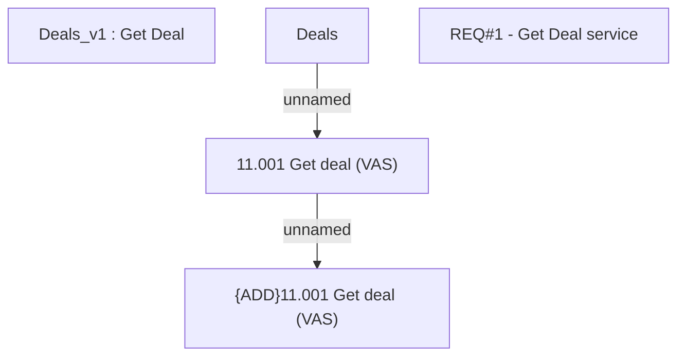

# CSI-2110 Get Deal method implementation

- **Diagram Type**: Custom
- **Package**: HomerSelect/BSL/Modules/Value Added Services (VAS)/Requirement model/CBL-11727 (CSI-376) CSI Modularization - Insurance Contract/CSI-2110 Get Deal method implementation
- **Diagram ID**: 148252
- **Elements**: 5
- **Connectors**: 2

