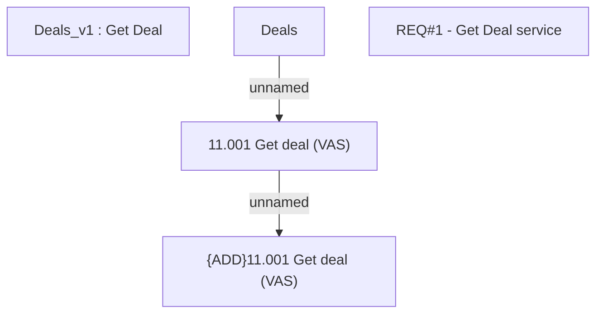

# CSI-2110 Get Deal method implementation

```mermaid
graph TD
    ADD_11_001_Get_deal_VAS["{ADD}11.001 Get deal (VAS)"]
    Deals_v1_Get_Deal["Deals_v1 : Get Deal"]
    n_11_001_Get_deal_VAS["11.001 Get deal (VAS)"]
    Deals["Deals"]
    REQ_1_Get_Deal_service["REQ#1 - Get Deal service"]
    n_11_001_Get_deal_VAS -->|unnamed| ADD_11_001_Get_deal_VAS
    Deals -->|unnamed| n_11_001_Get_deal_VAS
```
