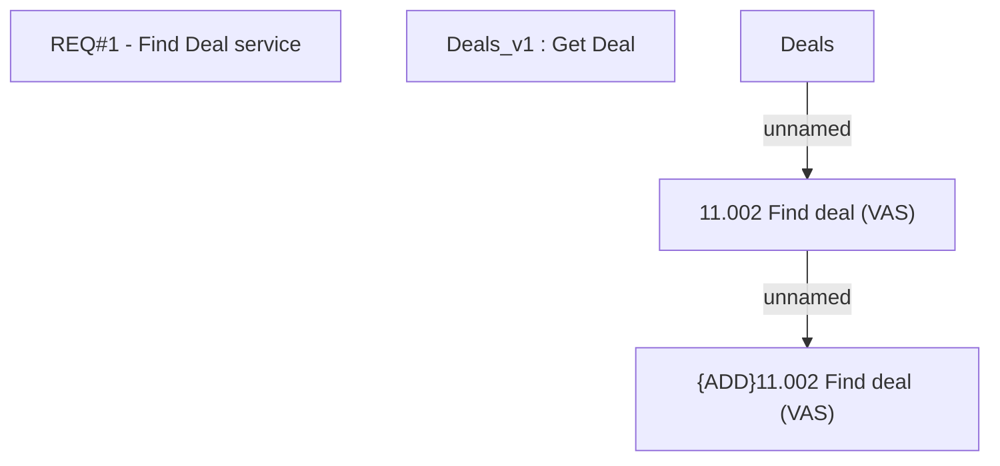

# CSI-2131 Find Deal method implementation

```mermaid
graph TD
    REQ_1_Find_Deal_service["REQ#1 - Find Deal service"]
    Deals_v1_Get_Deal["Deals_v1 : Get Deal"]
    ADD_11_002_Find_deal_VAS["{ADD}11.002 Find deal (VAS)"]
    n_11_002_Find_deal_VAS["11.002 Find deal (VAS)"]
    Deals["Deals"]
    n_11_002_Find_deal_VAS -->|unnamed| ADD_11_002_Find_deal_VAS
    Deals -->|unnamed| n_11_002_Find_deal_VAS
```
