# Features: CSI Modularization - Insurance Contract

- **Diagram Type**: Custom
- **Package**: HomerSelect/BSL/Modules/Value Added Services (VAS)/Requirement model/CBL-11727 (CSI-376) CSI Modularization - Insurance Contract/CSI-377 - Insurance Contract separation - init ANA/Insurance features
- **Diagram ID**: 142893
- **Elements**: 60
- **Connectors**: 79

```mermaid
graph TD
    Generate_a_list_of_available_insurances["Generate a list of available insurances"]
    Insurane_on_loan_contract_termination["Insurane on loan contract termination"]
    Service_Changed_on_Contract_notification["Service Changed on Contract notification"]
    el_1671474["Note"]
    Use_Case_Model_Activate_Insurance_contract["Use Case Model : Activate Insurance contract"]
    Use_Case_Model_Create_and_Sign_Insurance_contract["Use Case Model : Create and Sign Insurance contract"]
    Delete_insurance_contract_draft["Delete insurance contract draft"]
    Deactivate_insurance_on_contract["Deactivate insurance on contract"]
    Activate_insurance_on_contract["Activate insurance on contract"]
    Prolong_Ins_Period_on_DC_EoM["Prolong Ins Period on DC EoM"]
    Use_Case_Model_Insurance_on_REL_Contract_management["Use Case Model : Insurance on REL Contract management"]
    Use_Case_Model_Insurance_based_on_EOM_message["Use Case Model : Insurance based on EOM message"]
    Use_Case_Model_Insurance_based_on_EOM_event["Use Case Model : Insurance based on EOM event"]
    Use_Case_Model_Activate_Insurance_contract["Use Case Model : Activate Insurance contract"]
    Adding_insurance_to_contract_CEL["Adding insurance to contract CEL"]
    Cancel_Insurance["Cancel Insurance"]
    Insurance_replacement_CEL["Insurance replacement (CEL)"]
    Use_case_model_Replacement_of_standard_insurance_upon_its_ca["Use case model : Replacement of standard insurance upon its cancelation or termination"]
    Use_case_model_Termination_of_Insurance_contract_options["Use case model : Termination of Insurance contract options"]
    Use_case_model_Cancellation_of_Insurance_contract_options["Use case model : Cancellation of Insurance contract options"]
    Use_Case_Model_Adding_Insurance_Service_on_REL_contract["Use Case Model : Adding Insurance Service on REL contract"]
    Insurance_Contract_notification["Insurance Contract notification"]
    Premium_calculation_INSR["Premium calculation INSR"]
    el_1671471["Note"]
    Prepare_documents_in_AF["Prepare documents in AF "]
    el_1671482["Note"]
    OutgoingPayment["OutgoingPayment"]
    Activate_Contract["Activate Contract "]
    First_Transaction_in_AM["First Transaction in AM"]
    EoM_in_AM["EoM in AM"]
    EoM_in_Debt_Catalog["EoM in Debt Catalog"]
    Insurance_Service["Insurance Service"]
    Service["Service"]
    Paidoff_Contract["Paidoff Contract "]
    Finish_Contract["Finish Contract "]
    Time_job["Time (job)"]
    Cancel_Contract["Cancel Contract "]
    User_Web_service["User / Web service"]
    Sign_Contract["Sign Contract "]
    Contract_Insurance_Service["Contract Insurance Service"]
    Contract_Service["Contract Service"]
    Contract["Contract"]
    Adding_insurance_to_contract_REL["Adding insurance to contract REL"]
    Insurance_Period["Insurance Period"]
    Insurance_Contract["Insurance Contract"]
    Insurance_switch_off["Insurance switch-off"]
    Insurance_switch_on["Insurance switch-on"]
    Insurance_Contract_sign_activate["Insurance Contract sign/activate"]
    Insurance_Contract_update["Insurance Contract update"]
    Insurance_prolongation_on_time_REL["Insurance prolongation on time REL"]
    Prolong_Insurance_Period_based_on_EOM["Prolong Insurance Period based on EOM"]
    Insurance_Period_update["Insurance Period update"]
    Activate_Insurance_on_REL_contract["Activate Insurance on REL contract"]
    Insurance_triggering_CEL["Insurance triggering CEL"]
    Add_Insurance_Period["Add Insurance Period"]
    Insurance_Contract_creation_CEL["Insurance Contract creation - CEL"]
    Insurance_Contract_creation_REL["Insurance Contract creation - REL"]
    Insurance_Contract_creation["Insurance Contract creation"]
    Insurance_Contract_cancellation["Insurance Contract cancellation"]
    Insurance_Contract_termination["Insurance Contract termination"]
    Paidoff_Contract -->|unnamed| Insurance_switch_off
    el_1671482 -->|unnamed| Contract_Insurance_Service
    Contract_Insurance_Service -->|unnamed| Contract_Service
    Contract_Service -->|unnamed| Contract
    User_Web_service -->|unnamed| Adding_insurance_to_contract_REL
    Service_Changed_on_Contract_notification -->|unnamed| Adding_insurance_to_contract_REL
    Use_Case_Model_Adding_Insurance_Service_on_REL_contract -->|unnamed| Adding_insurance_to_contract_REL
    Activate_insurance_on_contract -->|unnamed| Adding_insurance_to_contract_REL
    User_Web_service -->|unnamed| Generate_a_list_of_available_insurances
    Deactivate_insurance_on_contract -->|unnamed| Insurance_switch_off
    Insurance_Service -->|unnamed| Service
    User_Web_service -->|unnamed| Insurance_switch_on
    Use_Case_Model_Activate_Insurance_contract -->|unnamed| Insurance_Contract_sign_activate
    Insurance_Contract_notification -->|unnamed| Insurance_Contract_update
    Insurance_switch_off -->|unnamed| Insurance_Contract_update
    Insurance_switch_on -->|unnamed| Insurance_Contract_update
    Delete_insurance_contract_draft -->|unnamed| Insurance_Contract_update
    Insurance_Contract_sign_activate -->|unnamed| Insurance_Contract_update
    Insurance_Period -->|unnamed| Insurance_Contract
    Cancel_Insurance -->|unnamed| Insurance_replacement_CEL
    Prolong_Ins_Period_on_DC_EoM -->|unnamed| Insurane_on_loan_contract_termination
    Service_Changed_on_Contract_notification -->|unnamed| Insurane_on_loan_contract_termination
    Prepare_documents_in_AF -->|unnamed| Delete_insurance_contract_draft
    User_Web_service -->|unnamed| Deactivate_insurance_on_contract
    User_Web_service -->|unnamed| Activate_insurance_on_contract
    Use_Case_Model_Insurance_based_on_EOM_event -->|unnamed| Prolong_Ins_Period_on_DC_EoM
    EoM_in_Debt_Catalog -->|unnamed| Prolong_Ins_Period_on_DC_EoM
    Use_Case_Model_Insurance_on_REL_Contract_management -->|unnamed| User_Web_service
    Service_Changed_on_Contract_notification -->|unnamed| Adding_insurance_to_contract_CEL
    Contract_Service -->|unnamed| Service
    Use_case_model_Replacement_of_standard_insurance_upon_its_ca -->|unnamed| Insurance_replacement_CEL
    Prolong_Ins_Period_on_DC_EoM -->|unnamed| Premium_calculation_INSR
    Insurance_prolongation_on_time_REL -->|unnamed| Premium_calculation_INSR
    el_1671471 -->|unnamed| Prepare_documents_in_AF
    el_1671474 -->|unnamed| EoM_in_AM
    el_1671474 -->|unnamed| EoM_in_Debt_Catalog
    el_1671482 -->|unnamed| Insurance_Service
    Time_job -->|unnamed| Insurance_prolongation_on_time_REL
    Insurance_replacement_CEL -->|unnamed| Adding_insurance_to_contract_CEL
    Insurance_Contract_notification -->|unnamed| Insurance_Contract_creation
    Insurance_Contract_cancellation -->|unnamed| Insurance_Contract_update
    Activate_Insurance_on_REL_contract -->|unnamed| Add_Insurance_Period
    Insurance_triggering_CEL -->|unnamed| Add_Insurance_Period
    Adding_insurance_to_contract_CEL -->|unnamed| Insurance_Contract_creation_CEL
    Use_Case_Model_Create_and_Sign_Insurance_contract -->|unnamed| Insurance_Contract_creation_CEL
    Prepare_documents_in_AF -->|unnamed| Insurance_Contract_creation_CEL
    Adding_insurance_to_contract_REL -->|unnamed| Insurance_Contract_creation_REL
    Insurance_switch_on -->|unnamed| Add_Insurance_Period
    Prepare_documents_in_AF -->|unnamed| Insurance_Contract_creation_REL
    Activate_insurance_on_contract -->|unnamed| Add_Insurance_Period
    Insurance_Contract_creation_CEL -->|unnamed| Insurance_Contract_creation
    Insurance_Contract_creation_REL -->|unnamed| Insurance_Contract_creation
    Use_case_model_Cancellation_of_Insurance_contract_options -->|unnamed| Insurance_Contract_cancellation
    Service_Changed_on_Contract_notification -->|unnamed| Insurance_Contract_cancellation
    Cancel_Contract -->|unnamed| Insurance_Contract_cancellation
    Use_case_model_Termination_of_Insurance_contract_options -->|unnamed| Insurance_Contract_termination
    Finish_Contract -->|unnamed| Insurance_Contract_termination
    Time_job -->|unnamed| Insurance_Contract_termination
    Use_Case_Model_Create_and_Sign_Insurance_contract -->|unnamed| Insurance_Contract_creation_REL
    Activate_Contract -->|unnamed| Activate_Insurance_on_REL_contract
    Insurane_on_loan_contract_termination -->|unnamed| Insurance_Contract_termination
    Use_Case_Model_Insurance_based_on_EOM_message -->|unnamed| Prolong_Insurance_Period_based_on_EOM
    EoM_in_AM -->|unnamed| Prolong_Insurance_Period_based_on_EOM
    Prolong_Insurance_Period_based_on_EOM -->|unnamed| Insurance_Period_update
    Insurance_switch_off -->|unnamed| Insurance_Period_update
    Prolong_Ins_Period_on_DC_EoM -->|unnamed| Insurance_Period_update
    Use_Case_Model_Activate_Insurance_contract -->|unnamed| Activate_Insurance_on_REL_contract
    Prolong_Insurance_Period_based_on_EOM -->|unnamed| Add_Insurance_Period
    Sign_Contract -->|unnamed| Activate_Insurance_on_REL_contract
    Insurance_Contract_termination -->|unnamed| Insurance_Contract_update
    Insurance_Contract_sign_activate -->|unnamed| Activate_Insurance_on_REL_contract
    Sign_Contract -->|unnamed| Activate_Insurance_on_REL_contract
    First_Transaction_in_AM -->|unnamed| Activate_Insurance_on_REL_contract
    Use_Case_Model_Activate_Insurance_contract -->|unnamed| Insurance_triggering_CEL
    Activate_Contract -->|unnamed| Insurance_triggering_CEL
    Insurance_Contract_sign_activate -->|unnamed| Insurance_triggering_CEL
    Sign_Contract -->|unnamed| Insurance_triggering_CEL
    Prolong_Ins_Period_on_DC_EoM -->|unnamed| Add_Insurance_Period
    Insurance_prolongation_on_time_REL -->|unnamed| Activate_Insurance_on_REL_contract
```

