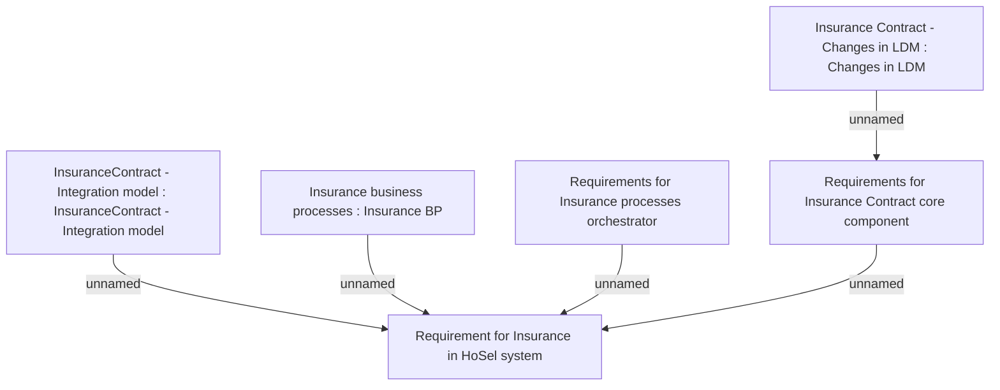

# Requirements for Insurance Contract separation

```mermaid
graph TD
    InsuranceContract_Integration_model_InsuranceContract_Integr["InsuranceContract - Integration model : InsuranceContract - Integration model"]
    Insurance_business_processes_Insurance_BP["Insurance business processes : Insurance BP"]
    Insurance_Contract_Changes_in_LDM_Changes_in_LDM["Insurance Contract - Changes in LDM : Changes in LDM"]
    Requirements_for_Insurance_processes_orchestrator["Requirements for Insurance processes orchestrator"]
    Requirements_for_Insurance_Contract_core_component["Requirements for Insurance Contract core component"]
    Requirement_for_Insurance_in_HoSel_system["Requirement for Insurance in HoSel system"]
    InsuranceContract_Integration_model_InsuranceContract_Integr -->|unnamed| Requirement_for_Insurance_in_HoSel_system
    Insurance_business_processes_Insurance_BP -->|unnamed| Requirement_for_Insurance_in_HoSel_system
    Requirements_for_Insurance_processes_orchestrator -->|unnamed| Requirement_for_Insurance_in_HoSel_system
    Requirements_for_Insurance_Contract_core_component -->|unnamed| Requirement_for_Insurance_in_HoSel_system
    Insurance_Contract_Changes_in_LDM_Changes_in_LDM -->|unnamed| Requirements_for_Insurance_Contract_core_component
```
