# Requirements: CBL-11727 (CSI-376) CSI Modularization - Insurance Contract

- **Diagram Type**: Custom
- **Package**: HomerSelect/BSL/Modules/Value Added Services (VAS)/Requirement model/CBL-11727 (CSI-376) CSI Modularization - Insurance Contract
- **Diagram ID**: 155561
- **Elements**: 26
- **Connectors**: 17

```mermaid
graph TD
    Create_notifications_for_Insurance_prolongation["Create notifications for Insurance prolongation"]
    Determine_next_insurance_period["Determine next insurance period"]
    Check_DPD_limit_for_insurance_prolongation["Check DPD limit for insurance prolongation"]
    el_1795111["Note"]
    n_11_081_Prolong_insurance_contracts["11.081 Prolong insurance contracts"]
    n_01_739_Process_Account_Balance_Change_EOM_notification["01.739 Process Account Balance Change EOM notification"]
    Deals_v1_Terminate_Deal["Deals_v1 : Terminate Deal"]
    CSI_2968_Terminate_Deal_method_CSI_2968_Terminate_Deal_metho["CSI-2968 Terminate Deal method : CSI-2968 Terminate Deal method - use cases"]
    CSI_2969_Cancel_Deal_method["CSI-2969 Cancel Deal method"]
    CSI_2968_Terminate_Deal_method["CSI-2968 Terminate Deal method"]
    CSI_2936_VAS_Deal_deactivation_method_CSI_2936_VAS_Deal_deac["CSI-2936 VAS Deal deactivation method : CSI-2936 VAS Deal deactivation method"]
    CSI_2918_VAS_Deal_activation_method_CSI_2918_VAS_Deal_activa["CSI-2918 VAS Deal activation method : CSI-2918 VAS Deal activation method"]
    CSI_2967_Prolong_Deal_Period_method["CSI-2967 Prolong Deal Period method"]
    CSI_2936_VAS_Deal_deactivation_method["CSI-2936 VAS Deal deactivation method"]
    CSI_2918_VAS_Deal_activation_method["CSI-2918 VAS Deal activation method"]
    CSI_2131_Find_Deal_method_implementation_CSI_2131_Find_Deal_["CSI-2131 Find Deal method implementation : CSI-2131 Find Deal method implementation"]
    CSI_2131_Find_Deal_method_implementation["CSI-2131 Find Deal method implementation"]
    CSI_1806_Create_Deal_method_modification["CSI-1806 Create Deal method modification"]
    CSI_1806_Create_Deal_method_modification_CSI_1806_Create_Dea["CSI-1806 Create Deal method modification : CSI-1806 Create Deal method modification"]
    CSI_1454_Create_Deal_method_implementation_CSI_1454_Create_D["CSI-1454 Create Deal method implementation : CSI-1454 Create Deal method implementation"]
    CSI_2110_Get_Deal_method_implementation_CSI_2110_Get_Deal_me["CSI-2110 Get Deal method implementation : CSI-2110 Get Deal method implementation"]
    CSI_1660_Period_methods_implementation_CSI_1660_Period_metho["CSI-1660 Period methods implementation : CSI-1660 Period methods implementation"]
    REQ_Changes_in_Insurance_Contract_data_model["REQ # - Changes in Insurance Contract data model"]
    CSI_1660_Period_methods_implementation["CSI-1660 Period methods implementation"]
    CSI_1454_Create_Deal_method_implementation["CSI-1454 Create Deal method implementation"]
    CSI_2110_Get_Deal_method_implementation["CSI-2110 Get Deal method implementation"]
    CSI_2918_VAS_Deal_activation_method_CSI_2918_VAS_Deal_activa -->|unnamed| CSI_2918_VAS_Deal_activation_method
    Deals_v1_Terminate_Deal -->|unnamed| CSI_2968_Terminate_Deal_method
    CSI_2936_VAS_Deal_deactivation_method_CSI_2936_VAS_Deal_deac -->|unnamed| CSI_2936_VAS_Deal_deactivation_method
    CSI_2110_Get_Deal_method_implementation_CSI_2110_Get_Deal_me -->|unnamed| CSI_2110_Get_Deal_method_implementation
    CSI_2131_Find_Deal_method_implementation_CSI_2131_Find_Deal_ -->|unnamed| CSI_2131_Find_Deal_method_implementation
    CSI_1806_Create_Deal_method_modification_CSI_1806_Create_Dea -->|unnamed| CSI_1806_Create_Deal_method_modification
    CSI_1660_Period_methods_implementation_CSI_1660_Period_metho -->|unnamed| CSI_1660_Period_methods_implementation
    CSI_1454_Create_Deal_method_implementation_CSI_1454_Create_D -->|unnamed| CSI_1454_Create_Deal_method_implementation
    REQ_Changes_in_Insurance_Contract_data_model -->|unnamed| CSI_1454_Create_Deal_method_implementation
    CSI_1806_Create_Deal_method_modification -->|unnamed| CSI_1454_Create_Deal_method_implementation
    CSI_2968_Terminate_Deal_method_CSI_2968_Terminate_Deal_metho -->|unnamed| CSI_2968_Terminate_Deal_method
    n_11_081_Prolong_insurance_contracts -->|unnamed| Create_notifications_for_Insurance_prolongation
    n_11_081_Prolong_insurance_contracts -->|unnamed| Determine_next_insurance_period
    n_11_081_Prolong_insurance_contracts -->|unnamed| Check_DPD_limit_for_insurance_prolongation
    n_01_739_Process_Account_Balance_Change_EOM_notification -->|unnamed| Create_notifications_for_Insurance_prolongation
    n_01_739_Process_Account_Balance_Change_EOM_notification -->|unnamed| Check_DPD_limit_for_insurance_prolongation
    n_01_739_Process_Account_Balance_Change_EOM_notification -->|unnamed| Determine_next_insurance_period
```

