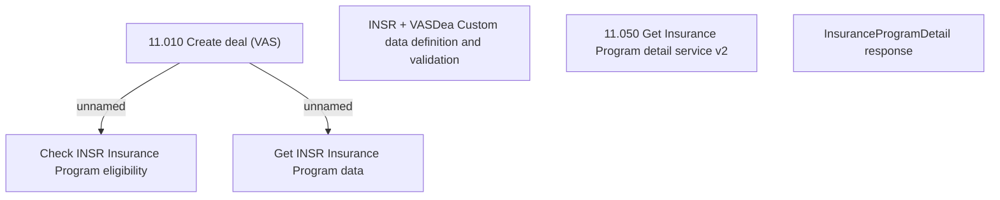

# CBL-12587 (CSI-1864) Custom data definition and validation

```mermaid
graph TD
    Check_INSR_Insurance_Program_eligibility["Check INSR Insurance Program eligibility"]
    n_11_010_Create_deal_VAS["11.010 Create deal (VAS)"]
    Get_INSR_Insurance_Program_data["Get INSR Insurance Program data"]
    INSR_VASDea_Custom_data_definition_and_validation["INSR + VASDea Custom data definition and validation"]
    n_11_050_Get_Insurance_Program_detail_service_v2["11.050 Get Insurance Program detail service v2"]
    InsuranceProgramDetail_response["InsuranceProgramDetail response"]
    n_11_010_Create_deal_VAS -->|unnamed| Check_INSR_Insurance_Program_eligibility
    n_11_010_Create_deal_VAS -->|unnamed| Get_INSR_Insurance_Program_data
```
