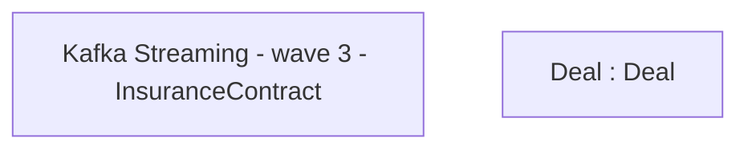

# CBL-16769 (CSI-1643) Kafka Streaming - InsuranceContract

- **Diagram Type**: Custom
- **Package**: HomerSelect/BSL/Modules/Value Added Services (VAS)/Requirement model/CBL-16769 (CSI-1643) Kafka Streaming - InsuranceContract
- **Diagram ID**: 146155
- **Elements**: 2
- **Connectors**: 0

