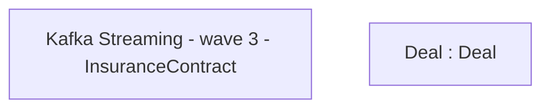

# CBL-16769 (CSI-1643) Kafka Streaming - InsuranceContract

```mermaid
graph TD
    Kafka_Streaming_wave_3_InsuranceContract["Kafka Streaming - wave 3 - InsuranceContract"]
    Deal_Deal["Deal : Deal"]
```
