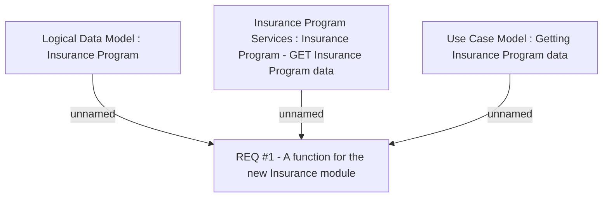

# CBL-3478 (CLM-1256) CLM Modularization - Insurance module

```mermaid
graph TD
    Logical_Data_Model_Insurance_Program["Logical Data Model : Insurance Program"]
    Insurance_Program_Services_Insurance_Program_GET_Insurance_P["Insurance Program Services : Insurance Program - GET Insurance Program data"]
    Use_Case_Model_Getting_Insurance_Program_data["Use Case Model : Getting Insurance Program data"]
    REQ_1_A_function_for_the_new_Insurance_module["REQ #1 - A function for the new Insurance module"]
    Logical_Data_Model_Insurance_Program -->|unnamed| REQ_1_A_function_for_the_new_Insurance_module
    Insurance_Program_Services_Insurance_Program_GET_Insurance_P -->|unnamed| REQ_1_A_function_for_the_new_Insurance_module
    Use_Case_Model_Getting_Insurance_Program_data -->|unnamed| REQ_1_A_function_for_the_new_Insurance_module
```
