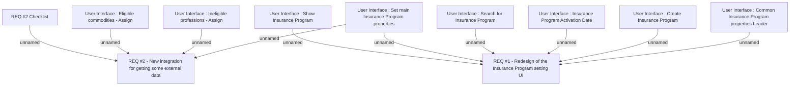

# CBL-8508 (CLM-2616) CLM Modularization - Insurance Program UI

```mermaid
graph TD
    REQ_2_Checklist["REQ #2 Checklist"]
    User_Interface_Eligible_commodities_Assign["User Interface : Eligible commodities - Assign"]
    User_Interface_Ineligible_professions_Assign["User Interface : Ineligible professions - Assign"]
    REQ_2_New_integration_for_getting_some_external_data["REQ #2 - New integration for getting some external data"]
    REQ_1_Redesign_of_the_Insurance_Program_setting_UI["REQ #1 - Redesign of the Insurance Program setting UI"]
    User_Interface_Show_Insurance_Program["User Interface : Show Insurance Program"]
    User_Interface_Set_main_Insurance_Program_properties["User Interface : Set main Insurance Program properties"]
    User_Interface_Search_for_Insurance_Program["User Interface : Search for Insurance Program"]
    User_Interface_Insurance_Program_Activation_Date["User Interface : Insurance Program Activation Date"]
    User_Interface_Create_Insurance_Program["User Interface : Create Insurance Program"]
    User_Interface_Common_Insurance_Program_properties_header["User Interface : Common Insurance Program properties header"]
    User_Interface_Show_Insurance_Program -->|unnamed| REQ_1_Redesign_of_the_Insurance_Program_setting_UI
    User_Interface_Set_main_Insurance_Program_properties -->|unnamed| REQ_1_Redesign_of_the_Insurance_Program_setting_UI
    User_Interface_Search_for_Insurance_Program -->|unnamed| REQ_1_Redesign_of_the_Insurance_Program_setting_UI
    User_Interface_Insurance_Program_Activation_Date -->|unnamed| REQ_1_Redesign_of_the_Insurance_Program_setting_UI
    User_Interface_Create_Insurance_Program -->|unnamed| REQ_1_Redesign_of_the_Insurance_Program_setting_UI
    User_Interface_Common_Insurance_Program_properties_header -->|unnamed| REQ_1_Redesign_of_the_Insurance_Program_setting_UI
    REQ_2_Checklist -->|unnamed| REQ_2_New_integration_for_getting_some_external_data
    User_Interface_Eligible_commodities_Assign -->|unnamed| REQ_2_New_integration_for_getting_some_external_data
    User_Interface_Ineligible_professions_Assign -->|unnamed| REQ_2_New_integration_for_getting_some_external_data
    User_Interface_Set_main_Insurance_Program_properties -->|unnamed| REQ_2_New_integration_for_getting_some_external_data
```
