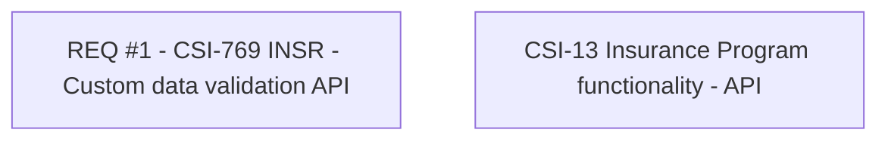

# CBL-8512 CLM Modularization - Insurance Program functionalities

- **Diagram Type**: Custom
- **Package**: HomerSelect/BSL/Modules/Value Added Services (VAS)/Requirement model/CBL-8512 (CSI-13) CLM Modularization - Insurance Program functionalities
- **Diagram ID**: 141042
- **Elements**: 2
- **Connectors**: 0

