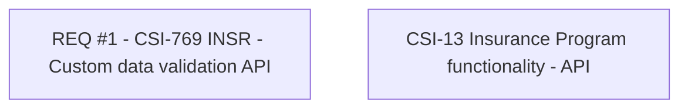

# CBL-8512 CLM Modularization - Insurance Program functionalities

```mermaid
graph TD
    REQ_1_CSI_769_INSR_Custom_data_validation_API["REQ #1 - CSI-769 INSR - Custom data validation API"]
    CSI_13_Insurance_Program_functionality_API["CSI-13 Insurance Program functionality - API"]
```
