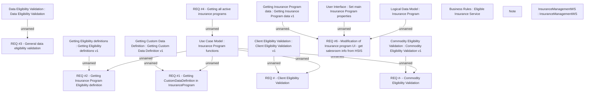

# CSI-13 Insurance Program functionality - API

```mermaid
graph TD
    REQ_4_Getting_all_active_insurance_programs["REQ #4 - Getting all active insurance programs"]
    Data_Eligibility_Validation_Data_Eligibility_Validation["Data Eligibility Validation : Data Eligibility Validation"]
    REQ_3_General_data_eligibility_validation["REQ #3 - General data eligibility validation"]
    Getting_Insurance_Program_data_Getting_Insurance_Program_dat["Getting Insurance Program data : Getting Insurance Program data v1"]
    Use_Case_Model_Insurance_Program_functions["Use Case Model : Insurance Program functions"]
    Client_Eligibility_Validation_Client_Eligibility_Validation_["Client Eligibility Validation : Client Eligibility Validation v1"]
    Commodity_Eligibility_Validation_Commodity_Eligibility_Valid["Commodity Eligibility Validation : Commodity Eligibility Validation v1"]
    Getting_Eligibility_definitions_Getting_Eligibility_definiti["Getting Eligibility definitions : Getting Eligibility definitions v1"]
    REQ_2_Getting_Insurance_Program_Eligibility_definition["REQ #2 - Getting Insurance Program Eligibility definition"]
    User_Interface_Set_main_Insurance_Program_properties["User Interface : Set main Insurance Program properties"]
    Logical_Data_Model_Insurance_Program["Logical Data Model : Insurance Program"]
    REQ_6_Modification_of_Insurance_program_UI_get_salesroom_inf["REQ #6 - Modification of Insurance program UI - get salesroom info from HSIS"]
    REQ_Commodity_Eligibility_Validation["REQ #- - Commodity Eligibility Validation"]
    REQ_Client_Eligibility_Validation["REQ # - Client Eligibility Validation"]
    Getting_Custom_Data_Definition_Getting_Custom_Data_Definitio["Getting Custom Data Definition : Getting Custom Data Definition v1"]
    Business_Rules_Eligible_Insurance_Service["Business Rules : Eligible Insurance Service"]
    el_1654069["Note"]
    Logical_Data_Model_Insurance_Program["Logical Data Model : Insurance Program"]
    InsuranceManagementWS_InsuranceManagementWS["InsuranceManagementWS : InsuranceManagementWS"]
    REQ_1_Getting_CustomDataDefinition_in_InsuranceProgram["REQ #1 - Getting CustomDataDefinition in InsuranceProgram"]
    REQ_4_Getting_all_active_insurance_programs -->|unnamed| Use_Case_Model_Insurance_Program_functions
    Getting_Eligibility_definitions_Getting_Eligibility_definiti -->|unnamed| REQ_2_Getting_Insurance_Program_Eligibility_definition
    Client_Eligibility_Validation_Client_Eligibility_Validation_ -->|unnamed| REQ_Client_Eligibility_Validation
    Getting_Custom_Data_Definition_Getting_Custom_Data_Definitio -->|unnamed| REQ_1_Getting_CustomDataDefinition_in_InsuranceProgram
    Use_Case_Model_Insurance_Program_functions -->|unnamed| REQ_2_Getting_Insurance_Program_Eligibility_definition
    Getting_Insurance_Program_data_Getting_Insurance_Program_dat -->|unnamed| REQ_6_Modification_of_Insurance_program_UI_get_salesroom_inf
    User_Interface_Set_main_Insurance_Program_properties -->|unnamed| REQ_6_Modification_of_Insurance_program_UI_get_salesroom_inf
    Use_Case_Model_Insurance_Program_functions -->|unnamed| REQ_1_Getting_CustomDataDefinition_in_InsuranceProgram
    Data_Eligibility_Validation_Data_Eligibility_Validation -->|unnamed| REQ_3_General_data_eligibility_validation
    Commodity_Eligibility_Validation_Commodity_Eligibility_Valid -->|unnamed| REQ_Commodity_Eligibility_Validation
    Use_Case_Model_Insurance_Program_functions -->|unnamed| REQ_Client_Eligibility_Validation
    Use_Case_Model_Insurance_Program_functions -->|unnamed| REQ_Commodity_Eligibility_Validation
    Logical_Data_Model_Insurance_Program -->|unnamed| REQ_6_Modification_of_Insurance_program_UI_get_salesroom_inf
```
