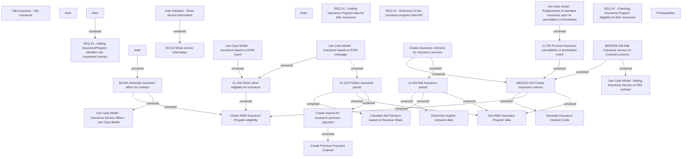

# CSI-548 INSR - integrate BSL to module API

```mermaid
graph TD
    Tab_Insurance_Tab_Insurance["Tab-Insurance : Tab-Insurance"]
    el_1601378["Note"]
    Check_INSR_Insurance_Program_eligibility["Check INSR Insurance Program eligibility"]
    Get_INSR_Insurance_Program_data["Get INSR Insurance Program data"]
    n_11_020_Add_insurance_period["11.020 Add insurance period"]
    REQ_1_Adding_InsuranceProgram_identifier_into_InsuranceContr["REQ #1 - Adding InsuranceProgram identifier into InsuranceContract"]
    Generate_Insurance_Contract_Code["Generate Insurance Contract Code"]
    Create_request_for_insurance_premium_payment["Create request for insurance premium payment"]
    el_1601382["Note"]
    el_1601380["Note"]
    User_Interface_Show_service_information["User Interface : Show service information"]
    n_08_010_Show_service_information["08.010 Show service information"]
    el_1601381["Note"]
    REQ_1_Getting_Insurance_Program_data_for_BSL_Insurance["REQ #1 - Getting Insurance Program data for BSL Insurance"]
    REQ_1_Extension_of_Get_insurance_program_data_API["REQ #1 - Extension of Get insurance program data API"]
    Use_case_model_Replacement_of_standard_insurance_upon_its_ca["Use case model : Replacement of standard insurance upon its cancelation or termination"]
    Use_Case_Model_Insurance_based_on_EOM_event["Use Case Model : Insurance based on EOM event"]
    Use_Case_Model_Insurance_based_on_EOM_message["Use Case Model : Insurance based on EOM message"]
    Use_Case_Model_Adding_Insurance_Service_on_REL_contract["Use Case Model : Adding Insurance Service on REL contract"]
    Use_Case_Model_Insurance_Service_Offers_Use_Case_Model["Use Case Model : Insurance Service Offers - Use Case Model"]
    Calculate_Net_Premium_based_on_Revenue_Share["Calculate Net Premium based on Revenue Share"]
    Determine_register_inclusion_date["Determine register inclusion date"]
    Create_insurance_contracts_for_insurance_services["Create insurance contracts for insurance services"]
    Create_Premium_Payment_Channel["Create Premium Payment Channel"]
    n_11_126_Check_client_eligibility_for_insurance["11.126 Check client eligibility for insurance"]
    MOD_11_010_Create_insurance_contract["{MOD}11.010 Create insurance contract"]
    n_11_122_Finalize_insurance_period["11.122 Finalize insurance period"]
    n_11_780_Process_Insurance_cancellation_or_termination_event["11.780 Process Insurance cancellation or termination event"]
    MOD_08_346_Add_Insurance_service_on_Contract_common["{MOD}08.346 Add Insurance service on Contract common"]
    n_08_344_Generate_insurance_offers_for_contract["08.344 Generate insurance offers for contract"]
    REQ_2_Checking_Insurance_Program_eligibility_for_BSL_Insuran["REQ #2 - Checking Insurance Program eligibility for BSL Insurance"]
    Prerequisities["Prerequisities"]
    el_1601382 -->|unnamed| REQ_1_Adding_InsuranceProgram_identifier_into_InsuranceContr
    el_1601380 -->|unnamed| n_08_344_Generate_insurance_offers_for_contract
    Use_Case_Model_Insurance_based_on_EOM_message -->|unnamed| n_11_126_Check_client_eligibility_for_insurance
    Use_Case_Model_Insurance_based_on_EOM_event -->|unnamed| n_11_126_Check_client_eligibility_for_insurance
    Use_Case_Model_Insurance_based_on_EOM_message -->|unnamed| n_11_122_Finalize_insurance_period
    Use_case_model_Replacement_of_standard_insurance_upon_its_ca -->|unnamed| n_11_780_Process_Insurance_cancellation_or_termination_event
    User_Interface_Show_service_information -->|unnamed| n_08_010_Show_service_information
    n_11_780_Process_Insurance_cancellation_or_termination_event -->|unnamed| MOD_11_010_Create_insurance_contract
    MOD_08_346_Add_Insurance_service_on_Contract_common -->|unnamed| MOD_11_010_Create_insurance_contract
    n_08_344_Generate_insurance_offers_for_contract -->|unnamed| Check_INSR_Insurance_Program_eligibility
    n_11_122_Finalize_insurance_period -->|unnamed| Calculate_Net_Premium_based_on_Revenue_Share
    n_11_122_Finalize_insurance_period -->|unnamed| Get_INSR_Insurance_Program_data
    n_11_122_Finalize_insurance_period -->|unnamed| Create_request_for_insurance_premium_payment
    n_11_020_Add_insurance_period -->|unnamed| Determine_register_inclusion_date
    n_11_020_Add_insurance_period -->|unnamed| Calculate_Net_Premium_based_on_Revenue_Share
    n_11_020_Add_insurance_period -->|unnamed| Get_INSR_Insurance_Program_data
    MOD_11_010_Create_insurance_contract -->|unnamed| Generate_Insurance_Contract_Code
    MOD_11_010_Create_insurance_contract -->|unnamed| Check_INSR_Insurance_Program_eligibility
    MOD_11_010_Create_insurance_contract -->|unnamed| Get_INSR_Insurance_Program_data
    n_11_126_Check_client_eligibility_for_insurance -->|unnamed| Check_INSR_Insurance_Program_eligibility
    Create_insurance_contracts_for_insurance_services -->|unnamed| MOD_11_010_Create_insurance_contract
    Create_insurance_contracts_for_insurance_services -->|unnamed| n_11_020_Add_insurance_period
    Create_request_for_insurance_premium_payment -->|unnamed| Create_Premium_Payment_Channel
    n_08_344_Generate_insurance_offers_for_contract -->|unnamed| Use_Case_Model_Insurance_Service_Offers_Use_Case_Model
    MOD_08_346_Add_Insurance_service_on_Contract_common -->|unnamed| Use_Case_Model_Adding_Insurance_Service_on_REL_contract
```
