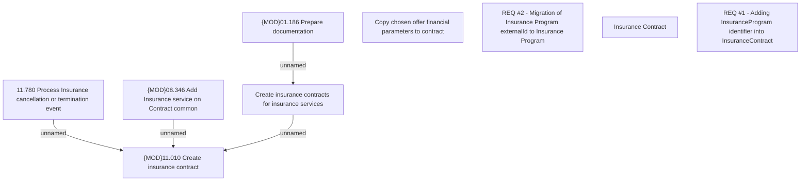

# CSI-608 Adding InsuranceProgram identifier into InsuranceContract

- **Diagram Type**: Custom
- **Package**: HomerSelect/BSL/Modules/Value Added Services (VAS)/Requirement model/CBL-8512 (CSI-13) CLM Modularization - Insurance Program functionalities/CSI-608 Adding InsuranceProgram identifier into InsuranceContract
- **Diagram ID**: 135395
- **Elements**: 9
- **Connectors**: 4

