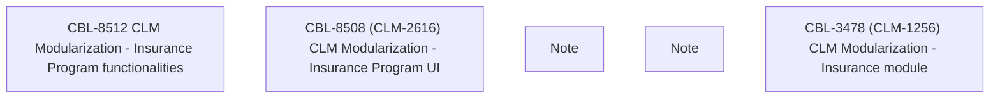

# Insurance Separation procedure overview

- **Diagram Type**: Custom
- **Package**: HomerSelect/BSL/Modules/Value Added Services (VAS)/Requirement model/_Insurance Separation procedure overview
- **Diagram ID**: 122170
- **Elements**: 5
- **Connectors**: 0

