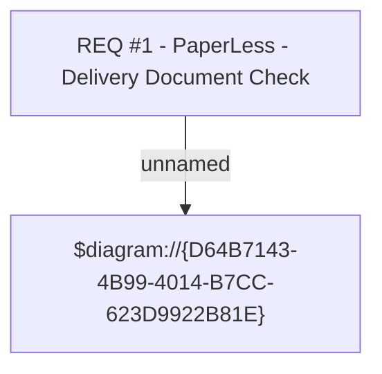

#  CLM-293 (CBL-94) PaperLess - Delivery Document Check

- **Diagram Type**: Custom
- **Package**: HomerSelect/BSL/Requirements Model/Finished/CLM/ CLM-293 (CBL-94) PaperLess - Delivery Document Check
- **Diagram ID**: 158920
- **Elements**: 2
- **Connectors**: 1

