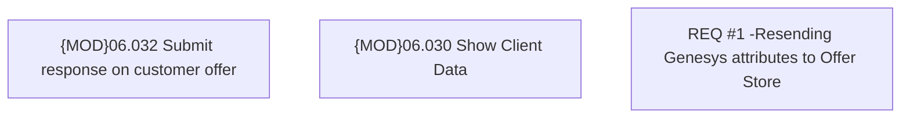

# CBL-10179 (CLM-3194) Resending two Genesys attributes to Offer Store

- **Diagram Type**: Custom
- **Package**: HomerSelect/BSL/Requirements Model/Finished/CLM/CBL-10179 (CLM-3194) Resending two Genesys attributes to Offer Store
- **Diagram ID**: 144829
- **Elements**: 3
- **Connectors**: 0

