# CBL-10294 - Write-off and pay-off

- **Diagram Type**: Custom
- **Package**: HomerSelect/BSL/Requirements Model/Finished/CLM/CBL-10294 (CLM-3808) Standalone Insurance as Installment
- **Diagram ID**: 144842
- **Elements**: 7
- **Connectors**: 0

```mermaid
graph TD
    MOD_Rules_for_finalization_of_Write_off_contracts["{MOD}Rules for finalization of Write-off contracts"]
    DEL_01_550_Process_request_for_contract_write_off["{DEL}01.550 Process request for contract write-off "]
    el_1834841["Note"]
    n_03_150_Regenerate_terminated_installment_schedule["03.150 Regenerate terminated installment schedule"]
    CBL_10294_New_SAI_Write_off_and_pay_off_contract["CBL-10294 - New SAI - Write-off and pay-off contract"]
    MOD_03_120_Pay_off_installment_schedule["{MOD}03.120 Pay off installment schedule"]
    Create_incoming_payment_rule["Create incoming payment rule"]
```

