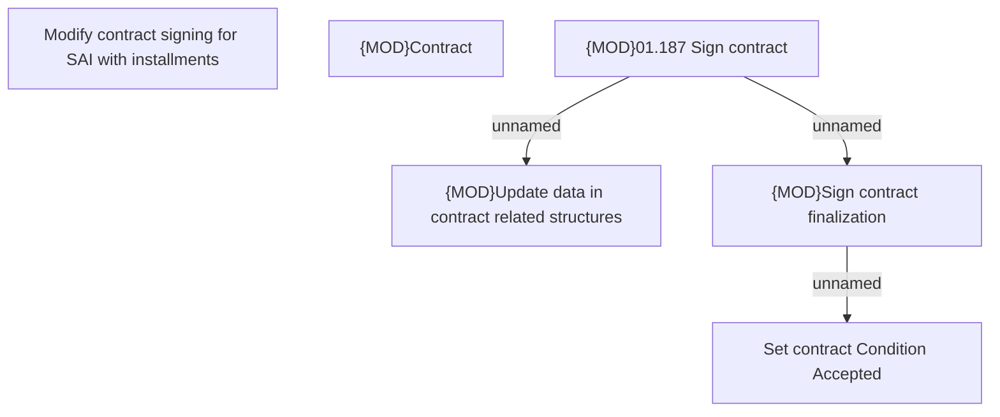

# CLM-3817 - New SAI - Contract signing

```mermaid
graph TD
    Modify_contract_signing_for_SAI_with_installments["Modify contract signing for SAI with installments"]
    MOD_Contract["{MOD}Contract"]
    MOD_Update_data_in_contract_related_structures["{MOD}Update data in contract related structures"]
    MOD_Sign_contract_finalization["{MOD}Sign contract finalization"]
    MOD_01_187_Sign_contract["{MOD}01.187 Sign contract"]
    Set_contract_Condition_Accepted["Set contract Condition Accepted"]
    MOD_01_187_Sign_contract -->|unnamed| MOD_Update_data_in_contract_related_structures
    MOD_01_187_Sign_contract -->|unnamed| MOD_Sign_contract_finalization
    MOD_Sign_contract_finalization -->|unnamed| Set_contract_Condition_Accepted
```
