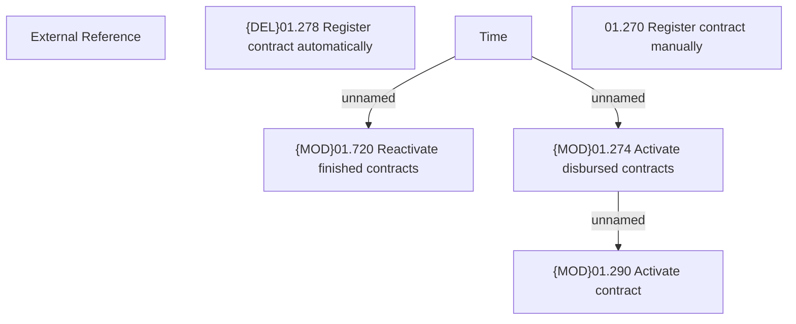

# CLM-3818 - Contract registration, activation and reactivation

- **Diagram Type**: Custom
- **Package**: HomerSelect/BSL/Requirements Model/Finished/CLM/CBL-10294 (CLM-3808) Standalone Insurance as Installment
- **Diagram ID**: 144840
- **Elements**: 7
- **Connectors**: 3

