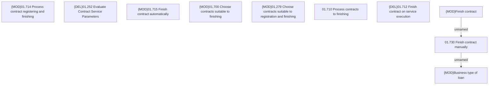

# CLM-3819 - New SAI - Contract finishing

- **Diagram Type**: Custom
- **Package**: HomerSelect/BSL/Requirements Model/Finished/CLM/CBL-10294 (CLM-3808) Standalone Insurance as Installment
- **Diagram ID**: 144841
- **Elements**: 10
- **Connectors**: 2

