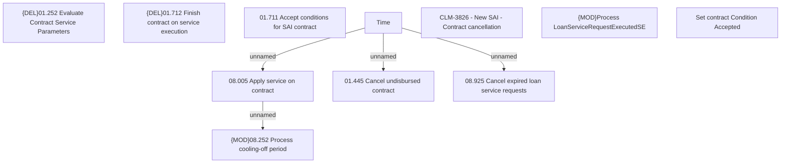

# CLM-3822 - New SAI - COP processing

- **Diagram Type**: Custom
- **Package**: HomerSelect/BSL/Requirements Model/Finished/CLM/CBL-10294 (CLM-3808) Standalone Insurance as Installment
- **Diagram ID**: 144843
- **Elements**: 11
- **Connectors**: 4

