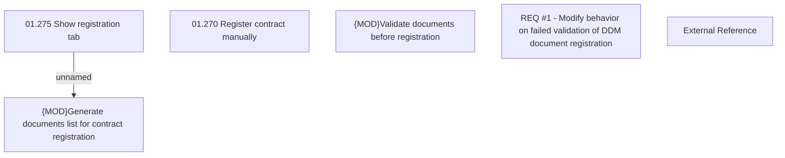

# CBL-10326 (CLM-3310) Missing SCAN mandates

```mermaid
graph TD
    MOD_Generate_documents_list_for_contract_registration["{MOD}Generate documents list for contract registration"]
    n_01_275_Show_registration_tab["01.275 Show registration tab"]
    n_01_270_Register_contract_manually["01.270 Register contract manually"]
    MOD_Validate_documents_before_registration["{MOD}Validate documents before registration"]
    REQ_1_Modify_behavior_on_failed_validation_of_DDM_document_r["REQ #1 - Modify behavior on failed validation of DDM document registration"]
    External_Reference["External Reference"]
    n_01_275_Show_registration_tab -->|unnamed| MOD_Generate_documents_list_for_contract_registration
```
