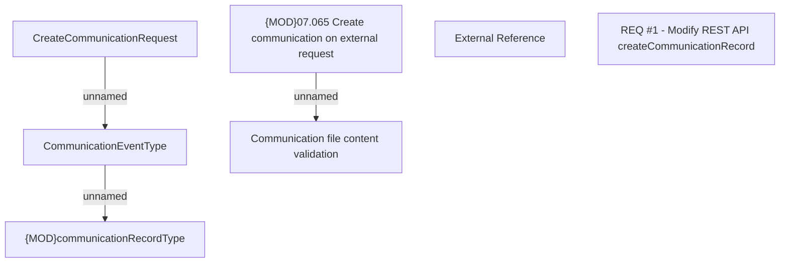

# CBL-10452 (CLM-3304) [HomeX] Change Communication Management REST service to follow current behavior on BSL

- **Diagram Type**: Custom
- **Package**: HomerSelect/BSL/Requirements Model/Finished/CLM/CBL-10452 (CLM-3304) [HomeX] Change Communication Management REST service to follow current behavior on BSL
- **Diagram ID**: 144824
- **Elements**: 7
- **Connectors**: 5

