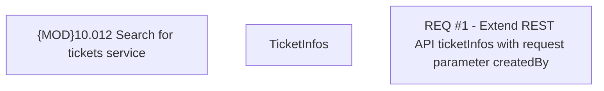

# CBL-10471 (CLM-3381) [HomeX] Add business user params to Search Ticket API

- **Diagram Type**: Custom
- **Package**: HomerSelect/BSL/Requirements Model/Finished/CLM/CBL-10471 (CLM-3381) [HomeX] Add business user params to Search Ticket API
- **Diagram ID**: 144823
- **Elements**: 3
- **Connectors**: 0

