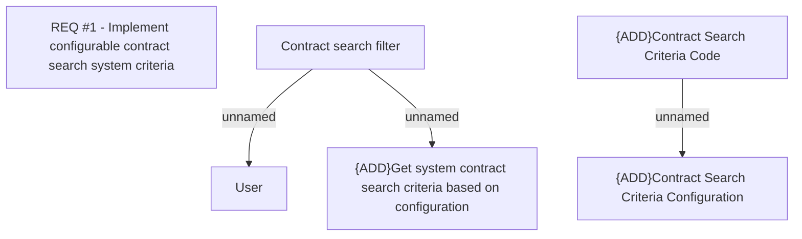

# REQ #1 - Implement configurable contract search system crieria

- **Diagram Type**: Custom
- **Package**: HomerSelect/BSL/Requirements Model/Finished/CLM/CBL-10618 (CLM-3352) Limitation of search function on BSL for back office
- **Diagram ID**: 144835
- **Elements**: 6
- **Connectors**: 3

