# REQ #3 - Implement CRM Search

- **Diagram Type**: Custom
- **Package**: HomerSelect/BSL/Requirements Model/Finished/CLM/CBL-10618 (CLM-3352) Limitation of search function on BSL for back office
- **Diagram ID**: 144834
- **Elements**: 25
- **Connectors**: 7

```mermaid
graph TD
    ADD_Contract_search_filter_Dynamic["{ADD}Contract search filter - Dynamic"]
    Include_mistakes["Include mistakes"]
    ADD_CRM_Search["{ADD}CRM Search"]
    Date_created_from["Date created from"]
    Date_created_to["Date created to"]
    Contract_status["Contract status"]
    National_Identification_Number["National Identification Number"]
    Vin_Code["Vin Code"]
    Document_ID_number["Document ID number"]
    Document_type["Document type"]
    Contract_number["Contract number"]
    ADD_CRM_Search["{ADD}CRM Search"]
    ADD_CRM_Search["{ADD}CRM Search"]
    User_Interface_Model_Search_for_contract["User Interface Model : Search for contract"]
    ADD_CRM_Search_criteria_restriction["{ADD}CRM Search criteria restriction"]
    ADD_CRM_Search_criteria_restriction["{ADD}CRM Search criteria restriction"]
    Validation_rules_Validation_rules["Validation rules : Validation rules"]
    Access_Rights_Contract_search_Access_Rights["Access Rights : Contract search - Access Rights"]
    UseCase_Model_Contract_search["UseCase Model : Contract search"]
    ADD_01_300_Search_for_contract_CRM_Search["{ADD}01.300 Search for contract (CRM Search)"]
    REQ_3_Implement_CRM_Search["REQ #3 - Implement CRM Search"]
    ADD_Get_system_contract_search_criteria_based_on_configurati["{ADD}Get system contract search criteria based on configuration"]
    MOD_Contract_search_filter["{MOD}Contract search filter"]
    MOD_01_300_Search_for_contract["{MOD}01.300 Search for contract"]
    Contract_search["Contract search"]
    ADD_CRM_Search_criteria_restriction -->|unnamed| ADD_Get_system_contract_search_criteria_based_on_configurati
    ADD_CRM_Search_criteria_restriction -->|unnamed| ADD_CRM_Search_criteria_restriction
    MOD_01_300_Search_for_contract -->|unnamed| MOD_Contract_search_filter
    MOD_01_300_Search_for_contract -->|unnamed| ADD_01_300_Search_for_contract_CRM_Search
    MOD_Contract_search_filter -->|unnamed| ADD_Contract_search_filter_Dynamic
    MOD_Contract_search_filter -->|unnamed| ADD_Get_system_contract_search_criteria_based_on_configurati
    MOD_Contract_search_filter -->|unnamed| ADD_CRM_Search_criteria_restriction
```

