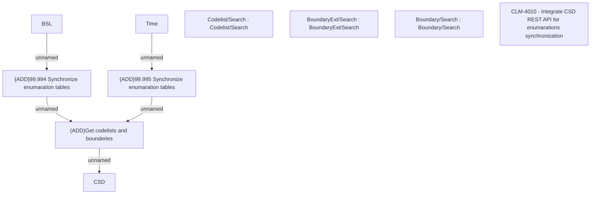

# CBL-10709 (CLM-4010) Switch codelistWS, boundaryWS and countryWS to REST in BSL

- **Diagram Type**: Custom
- **Package**: HomerSelect/BSL/Requirements Model/Finished/CLM/CBL-10709 (CLM-4010) Switch codelistWS, boundaryWS and countryWS to REST in BSL
- **Diagram ID**: 144852
- **Elements**: 10
- **Connectors**: 5

