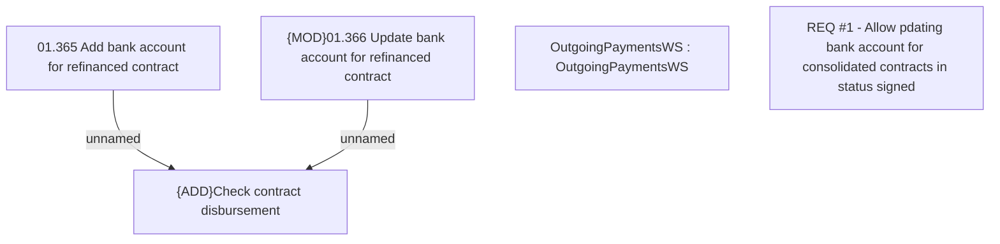

# CBL-11279 (CLM-3521) Updating External Bank information after contract signing in Consolidation tab

- **Diagram Type**: Custom
- **Package**: HomerSelect/BSL/Requirements Model/Finished/CLM/CBL-11279 (CLM-3521) Updating External Bank information after contract signing in Consolidation tab
- **Diagram ID**: 144830
- **Elements**: 5
- **Connectors**: 2

